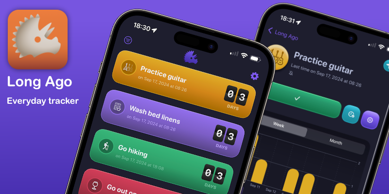
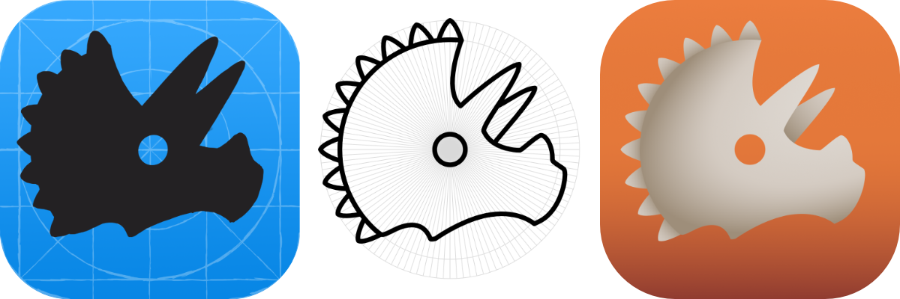

Long Ago is an activity logger built fully with **SwiftUI**.

## Coverage 🗞️

[Indie App Spotlight: 'Long Ago' helps you track your habits, chores, goals, and more - 9to5Mac](https://9to5mac.com/2024/10/12/indie-app-spotlight-long-ago/?utm_source=flipboard&utm_content=9to5mac%2Fmagazine%2FApps)

> I’m quite a big fan of the design of the app. It feels fluid, has nice haptics all over, and overall just feels like a unique design while still feeling native. The flip clock is a really nice touch as well, as well as the varying colors.

[The Hiro Report](https://www.hiro.report/)

> Long Ago is a neat utility for tracking how long it’s been since you’ve done, well, anything. You set up activities you want to track, document the last time you did them, and the app displays how much time has passed, both in the app and via lovely home screen widgets. It also offers reminders, goals, and metrics for each activity. I’m tracking when I last finished a book, how long it's been since I got some quality outdoor time, when I deep cleaned my espresso machine last, and when I last took my wife out on a date.

## Idea 💡

I am not the kind of person for whom the streaks method of habit keeping works. I just can't stick to it pretty well. My mind works better on time and numbers.

Long Ago started as my first project after dropping out of the [100 Days of SwiftUI](https://www.hackingwithswift.com/100/swiftui) around day 79 (I'm sorry, Paul!). I had this idea in my mind and wanted to dive right in.

It all started with the "flip board" like animation. Then I started thinking what I could use it for. Counting time of course!

## Technologies 🤖

I built this app as an opportunity to dive deeper into my Swift skills and get up to date with how to build a modern app for Apple ecosystems.

- Fully built with **SwiftUI** following MVVM.

  I focused heavily on gestures, interactivity, customization and animations which is the part that I enjoy the most.

  I built a whole theme system for managing colors and shades to enable more custom theming. _(I might Open Source this)_

- Cloud persisted with **Cloudkit** and **CoreData**.

  I started this app before SwiftData and I had never used CoreData before so decided to give it a try. _This was HARD!_ CoreData has a step mastery curve.

- **Widgetkit** for building Widgets for home screen, control center and lock screen (with stand by support).

  Everything supports interactivity and tinted colors in iOS 18.

- **AppIntents** for integrating with Siri, add interaction to widgets, focus filters and powerful shorcuts.

  I love automation and this app in particular lends itself to it a lot. I have automations to check in when I get to my office (detecting WiFi), when I take a cup of coffee (tapping on an NFC tag on my cup) or when particular events in my calendar happen.

- **Swift Charts** for showing trends

  This is my favorite library in Swift. I come from a background of working on telemetry systems on my jobs and SwiftCharts is by far one of the most enjoyable libs for charting things quickly.

  _Sneak Peek: I'm delving on it a lot more for the next updates_

## Icon 🎁

I designed the icon for Long Ago with **Affinity Designer**.

It wouldn't be possible without the help of my wonderful wife who was gracious enough to give me the best feedback and ideas but let me stumble my way through sketches and vectors because I enjoy learning.

## Inspiration 🎨

I have been truly inspired by some awesome people to find a style on Long Ago. I want to express my thanks giving them a shoutout:

- [Up Ahead](https://apps.apple.com/app/id1583147528): Just an incredibly fun app to upcoming events. I love everything about this app, the fun "gamefication" of the patterns that encourages you to keep using, the level of craft and personalization and it's laser focus on making a calendar joyful. Every part of Daniel's work in this app shows love and care. I can only hope my app is 1% as fun to use as Up Ahead. (_Note: I like to think of Long Ago as a complement to it. It's even in the name, get it???_ 😄)
- [Levi Hastings](https://www.levihastings.com/): Levi's art is just wonderful. I bumped into him on ECCC's artist alley on 2023 and I'm a big fan since. His depictions of dinosaurs are beautiful and colorful and yet he does a lot with few very careful touches.
- [Presets](https://apps.apple.com/us/app/presets-photos-app-companion/id6475609602): Sandro's work on UI is just another level of amazing. His craft on SwiftUI to bring back some glossy and 3D into buttons made me rethink of my UI and bring it to a place I finally felt unique. Don't miss his other SwiftUI companion app: [Kolibri](https://apps.apple.com/us/app/kolibri-for-swiftui/id6447380792)
- [Gola](https://apps.apple.com/us/app/gola-goal-tracking/id1661833753): Hidde made a very nice app for tracking year goals. Gola look is unique but what I enjoy the most is how he brought all tools towards a very focused goal of helping you stay on top of your commitments. This is exactly what indie apps are for.

## Questions ❓

**I'm looking for ideas for technical blog posts.** I want to give back to the Swift community as much as I've taken.

If you have any question about how I built something reach me out on [Mastodon](https://hachyderm.io/@oscb) or [email](mailto:oscar.b@icloud.com).

## Learn More 🦖

Visit [Long Ago's Website](https://longago.app)
